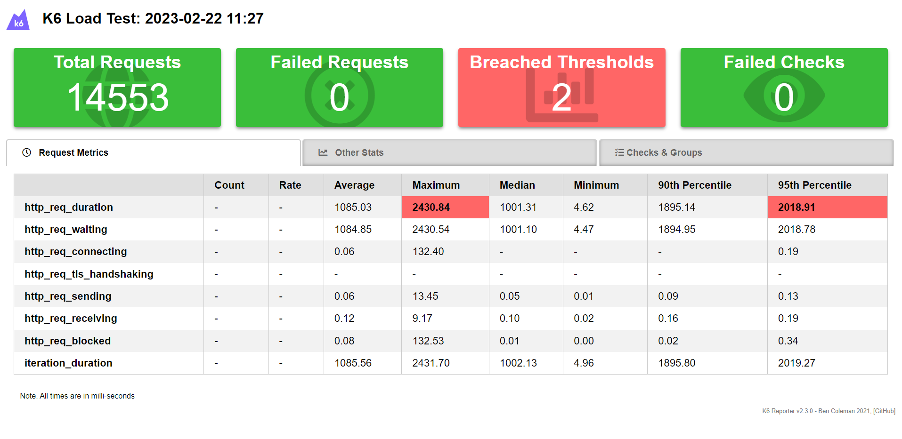
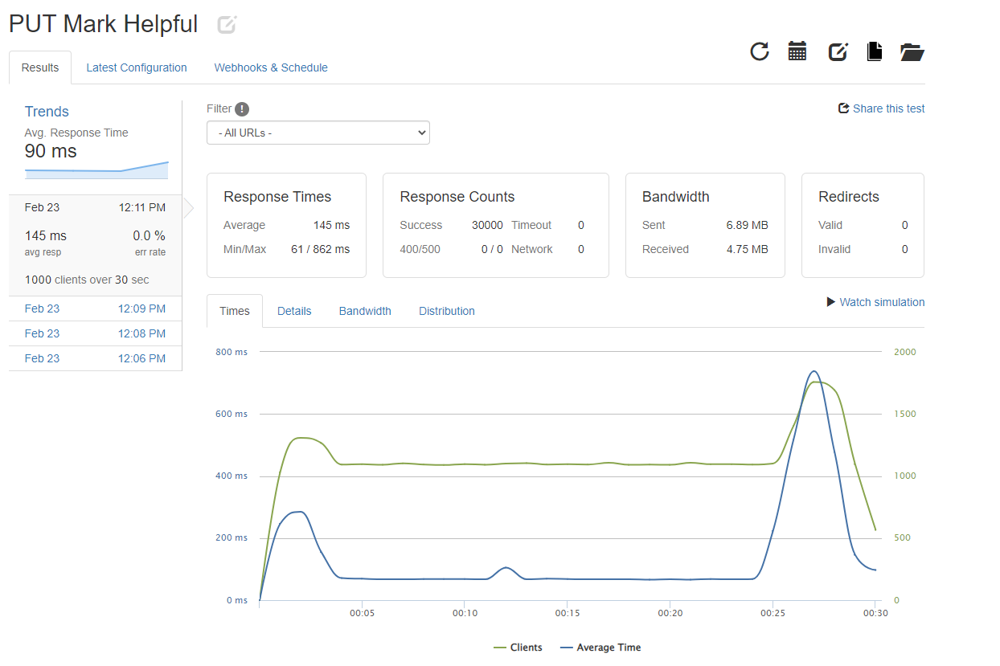

# E-Commerce System Redesign

## About the Project
A personal practice project to update and redesign the Ratings and Reviews API of an e-commerce platform to a CRUD RESTful one that can handle 6M+ products with considerations for scalability on the cloud.

Local stress testing was conducted with K-6.

Cloud testing with Loader.io to identify and remove latency bottlenecks.

Deployed server to AWS EC2 T2 micro instances and exceeded expcected throughput 5x and latency 3x by optimizing the server utilizing horizontal scaling and optimizing server instances via caching and load balancing with NGINX

## Built With:

## Tested With:

## Sample Results:

  <table><tr><td></td></tr></table> 
  <table><tr><td></td></tr></table> 
  <table><tr><td></td></tr></table>

